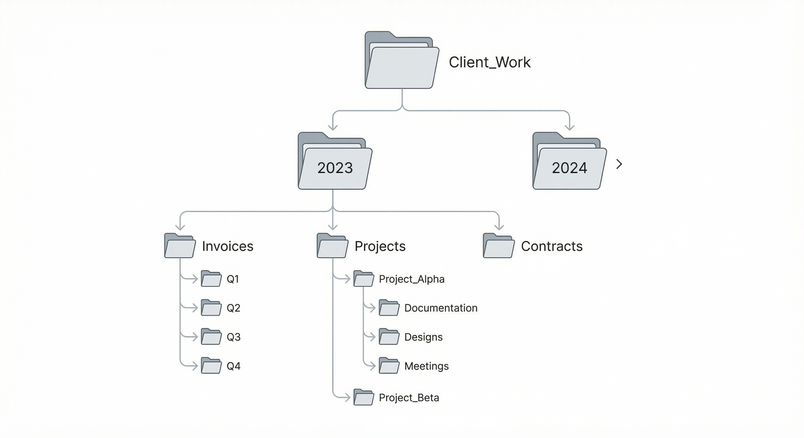

# Computer Training: Technical Writing and Communication

Technical writing is the art of communicating complex information clearly, accurately, and efficiently. Unlike creative writing, technical writing prioritizes precision over prose, clarity over creativity, and accuracy over artistry. This course provided a comprehensive foundation in professional technical communication, covering everything from writing objective documentation to managing data and delivering effective technical presentations.

The skills learned in this course are essential for any IT professional—whether documenting software features, reporting bugs, creating user guides, or presenting technical concepts to stakeholders. Technical writing bridges the gap between technical expertise and user understanding, making it one of the most valuable skills in the technology industry.

## 1. The Foundation: Objective & Precise Writing

Technical writing is not about being "creative"—it is about being **accurate**. The primary goal is to remove any chance of a reader misinterpreting your words. Every sentence should convey exactly what you mean, nothing more, nothing less.

### Objective vs. Subjective Language

We avoid opinions and emotional language. Instead of making subjective claims, we provide measurable, verifiable facts.

**Subjective (Avoid):**
- "The app is fast"
- "The interface is user-friendly"
- "The system works well"

**Objective (Prefer):**
- "The app processes data in under 2 seconds"
- "The interface requires three clicks to complete the task"
- "The system successfully processes 1,000 transactions per minute without errors"

### Low Abstraction: Specificity Matters

Abstract language creates ambiguity. Technical writing demands specificity at every level.

**Abstract (Unclear):**
- "Open the file on the device."
- "Navigate to the settings menu."
- "Submit the form when ready."

**Specific (Clear):**
- "Open the budget_2023.xlsx file on the Lenovo ThinkPad located in the Documents folder."
- "Click the Settings icon (gear symbol) in the top-right corner of the application window."
- "Click the 'Submit Application' button after verifying all required fields are completed."

The more specific your language, the less room there is for misinterpretation—and the faster users can complete their tasks.

## 2. User Documentation: Teaching the User

There is a fundamental difference between **telling** someone what to do and **teaching** them how to do it. Effective user documentation empowers users to accomplish tasks independently, building their confidence and competence.

### Step-by-Step Instructions

These are short, action-oriented commands that guide users through specific tasks. Each step should be:
- **Actionable**: Begin with a verb (Click, Select, Type, Navigate)
- **Specific**: Include exact locations, names, and values
- **Sequential**: Follow a logical order
- **Testable**: Users should be able to verify completion

**Example:**
> **Step 1:** On the Home tab, in the Font group, click the Font arrow (downward-pointing triangle).
> 
> **Step 2:** From the dropdown menu, select Comic Sans MS.
> 
> **Step 3:** Verify the font change by observing the selected text update in the document.

### Tutorial Documents

Tutorials go deeper than simple instructions. They use realistic scenarios and explain the "why" behind each step, helping users understand not just what to do, but why they're doing it.

**Key Elements of Effective Tutorials:**

- **Realistic Data**: Use examples that mirror real-world scenarios (e.g., "Family Budget" spreadsheet, "Garage Sale Flyer" document)
- **Context Setting**: Explain the purpose before diving into steps
- **Rationale**: Include explanations for important decisions
- **Verification Points**: Show users how to confirm they've completed steps correctly

**Example Tutorial Approach:**
> **Objective:** Save your document as a PDF to ensure the layout remains identical when viewed on different devices.
> 
> **Why This Matters:** PDF format preserves formatting, fonts, and layout regardless of the software or device used to open the file. This is essential when sharing documents with clients or colleagues who may not have the same software version.
> 
> **Steps:**
> 1. Click File > Save As
> 2. In the "Save as type" dropdown, select PDF
> 3. Click Save
> 
> **Verification:** Open the PDF file to confirm all formatting, images, and layout elements appear correctly.

Tutorials transform users from followers of instructions into independent problem-solvers who understand the underlying principles.

## 3. Problem Reporting: Bug Reports & Release Notes

When things go wrong—or when they improve—documentation becomes the primary communication tool between developers and users. Professional problem reporting accelerates issue resolution and builds user trust.

### The Anatomy of a Bug Report

To fix a problem, a developer needs to **recreate** it. A professional bug report provides all the information necessary to reproduce and diagnose the issue.

**Essential Components:**

1. **Environment Information**
   - Operating System: Windows 10, macOS 13.5, Ubuntu 22.04
   - Browser/Application Version: Chrome Version 114.0.5735.199
   - Hardware (if relevant): Dell XPS 15, 16GB RAM

2. **Steps to Reproduce**
   - Numbered, sequential steps
   - Include exact clicks, inputs, and navigation paths
   - Be specific about timing if relevant

3. **Expected Result**
   - What should happen under normal circumstances

4. **Actual Result**
   - What actually happened
   - Include error messages verbatim
   - Describe any visual anomalies

5. **Additional Context**
   - Frequency: Does it happen every time or intermittently?
   - Workarounds: Can users avoid the issue?
   - Impact: How does this affect user workflow?

**Example Bug Report:**


*Example of a well-structured bug report with all essential components*

> **Environment:** Windows 10, Chrome Version 114.0.5735.199
> 
> **Steps to Reproduce:**
> 1. Navigate to www.example.com and log in with credentials
> 2. Click the 'Profile' button in the top navigation bar
> 3. Click the 'Upload Photo' button
> 4. Select a JPEG image file (tested with image.jpg, 2.5MB)
> 5. Click 'Upload'
> 
> **Expected Result:** Photo uploads successfully and appears in the profile picture area.
> 
> **Actual Result:** Application crashes with Error 404. Browser console shows: "POST /api/upload failed: 404 Not Found"
> 
> **Frequency:** Occurs 100% of the time with files larger than 2MB
> 
> **Workaround:** Resizing images to under 1MB allows successful upload

### Release Notes

When new software versions are released, users need clear, concise summaries of changes. Release notes serve multiple purposes:
- **Inform** users about new features and improvements
- **Prepare** users for changes that might affect their workflow
- **Build trust** through transparency about fixes and known issues

**Structure:**

- **What's New:** New features and capabilities
- **What's Changed:** Modifications to existing features
- **Fixed Bugs:** Issues that have been resolved
- **Known Issues:** Problems that remain or were introduced

**Example Release Notes:**

> **Version 2.1.0 - January 2024**
> 
> **What's New:**
> - Added dark mode theme option in Settings
> - Introduced keyboard shortcuts for common actions (see Help > Keyboard Shortcuts)
> 
> **What's Changed:**
> - Improved file upload speed by 40%
> - Redesigned navigation menu for better mobile experience
> 
> **Fixed Bugs:**
> - Resolved issue where profile photos larger than 2MB caused application crashes
> - Fixed formatting error in exported PDF reports
> 
> **Known Issues:**
> - Dark mode may cause display issues on older monitors (workaround: use light mode)

## 4. Data Management: Excel as a Database

Technical communication often requires managing large amounts of structured data. This course explored using Microsoft Excel not just for calculations, but as a **structured database** for organizing and analyzing information.

### Database Terminology

Understanding database concepts helps structure data effectively:

- **Records**: Rows in a spreadsheet represent individual records (e.g., one employee, one customer, one transaction)
- **Fields**: Columns represent fields or attributes (e.g., Name, Email, Department, Salary)
- **Primary Key**: A unique identifier for each record (e.g., Employee ID)
- **Data Types**: Ensuring consistent formatting (text, numbers, dates)

### Sorting & Filtering: Finding Needles in Haystacks


*Example of multi-field sorting: Employees sorted by Department (A-Z) and then by Salary (Highest to Lowest)*

**Multi-Field Sorting:**

Complex sorting allows you to organize data by multiple criteria simultaneously. Excel processes sort criteria in order of priority.

**Example:** Sort employee records by:
1. **Primary Sort:** Department (A-Z)
2. **Secondary Sort:** Salary (Highest to Lowest)

This creates organized groups where employees within each department are ranked by salary, making it easy to identify top earners in each area.

**AutoFilter:**

Filtering allows you to display only records that meet specific criteria, hiding everything else temporarily.

**Example Criteria:**
- Show all employees hired in 1987 who have a performance grade higher than 70%
- Display all invoices from Q4 2023 that are still unpaid
- List all products with inventory below 50 units and supplier status "Active"

**Advanced Filtering Techniques:**

- **Multiple Criteria:** Combine conditions using AND/OR logic
- **Custom Filters:** Use formulas for complex conditions
- **Top/Bottom Filters:** Quickly identify highest or lowest values (e.g., "Top 10" by sales)

Mastering Excel as a database tool enables technical writers to:
- Organize large datasets for documentation
- Analyze user feedback and bug reports
- Track documentation versions and updates
- Generate reports and summaries

## 5. Information Organization: File Management

Professionalism starts with an **organized digital workspace**. Poor file management leads to lost documents, version confusion, and wasted time. Effective file organization is a foundational skill for any technical professional.

### Hierarchical Structures

Creating logical folder hierarchies ensures files are never "lost" and can be quickly located by anyone who needs them.

**Example Structure:**

```
Client_Work/
├── 2023/
│   ├── Invoices/
│   │   ├── Q1/
│   │   ├── Q2/
│   │   ├── Q3/
│   │   └── Q4/
│   ├── Projects/
│   │   ├── Project_Alpha/
│   │   │   ├── Documentation/
│   │   │   ├── Designs/
│   │   │   └── Meetings/
│   │   └── Project_Beta/
│   └── Contracts/
└── 2024/
    └── ...
```



*Visual representation of a well-organized file management structure*

**Best Practices:**

- **Consistent Naming:** Use clear, descriptive names (avoid "Document1", "Final", "Final_Final")
- **Date Formatting:** Use YYYY-MM-DD format for chronological sorting
- **Logical Grouping:** Organize by project, client, date, or function—choose what makes sense for your workflow
- **Avoid Deep Nesting:** Too many folder levels (more than 4-5) can hinder navigation

### Version Control

Using "Save As" effectively allows you to manage different iterations of a document without losing original data.

**Version Naming Strategies:**

- **Sequential:** `Document_v1.docx`, `Document_v2.docx`, `Document_v3.docx`
- **Date-Based:** `Document_2024-01-15.docx`, `Document_2024-01-20.docx`
- **Descriptive:** `Document_Draft.docx`, `Document_Review.docx`, `Document_Final.docx`
- **Hybrid:** `Document_v2_2024-01-20_Final.docx`

**Key Principle:** Never overwrite the original. Always create a new version when making significant changes, allowing you to revert if needed.

## 6. Technical Presentations: The Art of the Demo

Teaching a technical skill requires a **"Demonstration" mindset** rather than a "Lecture" mindset. Effective technical presentations show rather than tell, guide rather than dictate, and empower rather than overwhelm.

### The Effective Lesson Plan

A well-structured lesson plan ensures learners achieve specific objectives within a defined timeframe.

**Components:**

1. **Objective Statement**
   - What will the learner be able to do by the end?
   - Be specific and measurable
   - Example: "By the end of this 10-minute session, learners will be able to use Excel AutoFilter to find specific records in a dataset of 500+ rows."

2. **Must-Do Items**
   - Core skills that everyone must master
   - Essential for achieving the objective
   - Example: How to apply a basic filter, how to clear filters, how to filter by multiple criteria

3. **If-Time Items**
   - Advanced features for faster learners
   - Extensions that enhance but aren't essential
   - Example: Using 'Top 10' filters, custom filter formulas, advanced filtering with wildcards

**Lesson Plan Structure:**

> **Objective:** Learners will be able to use Excel AutoFilter to locate specific records in large datasets.
> 
> **Must-Do (10 minutes):**
> 1. Enable AutoFilter on a data table
> 2. Apply a single-criterion filter
> 3. Apply a multi-criterion filter
> 4. Clear filters to show all data
> 
> **If-Time (5 minutes):**
> - Use "Top 10" filter option
> - Create custom filter with formulas
> - Combine filters across multiple columns

### Visual Proof: Screen Captures

Clear, high-contrast screen captures with proper labeling are essential for technical presentations. They provide visual anchors that help learners follow along and verify they're in the right place.

**Best Practices for Screen Captures:**

- **High Contrast:** Ensure text and UI elements are clearly visible
- **Proper Labeling:** Use figure numbers and descriptive captions
- **Focused Content:** Crop to show only relevant areas
- **Consistent Style:** Use the same annotation style throughout
- **Callouts:** Highlight important elements with arrows, boxes, or circles

**Example Caption Format:**


**Figure 1: The Ribbon in Microsoft Word**

The Ribbon contains tabs (Home, Insert, Design) that organize commands into logical groups. The Font group on the Home tab contains text formatting options.

**Annotation Techniques:**

- **Numbered Callouts:** Number key elements and explain each in a legend
- **Color Coding:** Use colors to group related elements
- **Arrows:** Point to specific buttons or areas
- **Highlighting:** Use semi-transparent overlays to emphasize important sections

Visual aids transform abstract instructions into concrete guidance, reducing cognitive load and accelerating learning.

## 7. Ethics & Integrity: APA Documentation

Professional technical writing requires giving credit where it's due. Proper citation acknowledges the work of others, allows readers to verify sources, and maintains academic and professional integrity.

### APA Style Fundamentals

The American Psychological Association (APA) style is widely used in technical and academic writing. It provides a standardized format for citing both print and electronic sources.

**Key Principles:**

- **In-Text Citations:** Brief references within the document that point to full citations
- **Reference List:** Complete bibliographic information at the end of the document
- **Consistency:** All citations follow the same format throughout the document

### Citation Formats

**Print Book:**
> Author, A. A. (Year). *Title of work*. Publisher.

**Example:**
> Scollard, S. (2024). *Advanced Database Concepts*. Technical Press.

**Electronic Source with DOI:**
> Author, A. A. (Year). Title of work. *Journal Name*, *Volume*(Issue), Pages. https://doi.org/10.xxxx/xxxxx

**Example:**
> Scollard, S. (2024). Advanced Database Concepts. *Technical Computing Journal*, *15*(3), 45-62. https://doi.org/10.1016/j.tech.2024.01

**Website:**
> Author, A. A. (Year, Month Day). *Title of page*. Site Name. URL

**Example:**
> Microsoft Corporation. (2024, January 15). *Excel AutoFilter Guide*. Microsoft Support. https://support.microsoft.com/excel/autofilter

### Why Citations Matter

- **Credibility:** Shows you've researched your topic thoroughly
- **Transparency:** Allows readers to verify your claims
- **Legal Protection:** Prevents plagiarism and copyright issues
- **Professionalism:** Demonstrates attention to detail and respect for intellectual property

Proper documentation is not just about following rules—it's about maintaining the integrity of technical communication and contributing to a culture of knowledge sharing and verification.

## Reflection

This course transformed my understanding of professional communication. Technical writing is not a "soft skill"—it's a **hard requirement** for success in technology fields. The ability to write clearly, document accurately, and present effectively separates competent technicians from true professionals.

The most valuable lesson was learning to see documentation from the user's perspective. Every instruction, every explanation, every screen capture must answer the question: "Will this help someone accomplish their goal?" When documentation fails, it's usually because the writer focused on what they wanted to say rather than what the user needed to know.

Moving forward, I'll apply these principles to:
- **Software Documentation:** Creating user guides that empower rather than confuse
- **Technical Reports:** Writing bug reports and release notes that accelerate problem-solving
- **Data Management:** Organizing information in ways that make analysis efficient and accurate
- **Professional Presentations:** Delivering demos that teach rather than simply inform

Technical writing is the bridge between complex technology and human understanding. Mastering this skill makes you not just a better communicator, but a more effective technologist.
