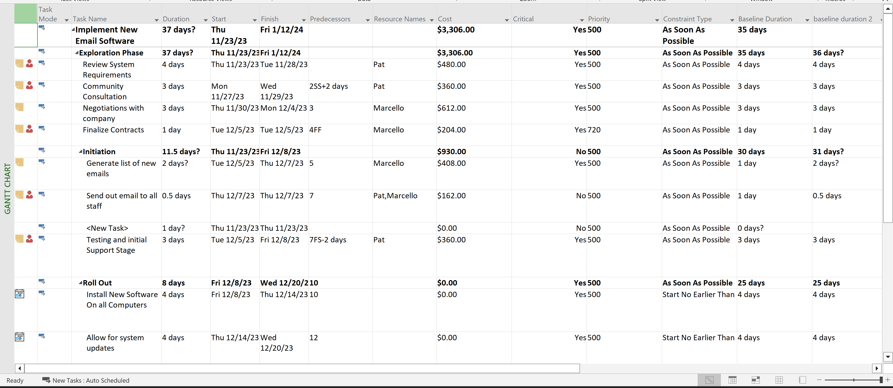
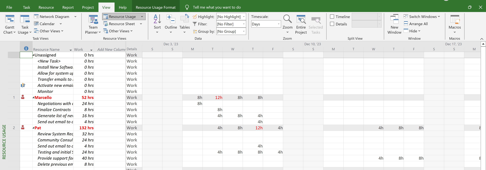
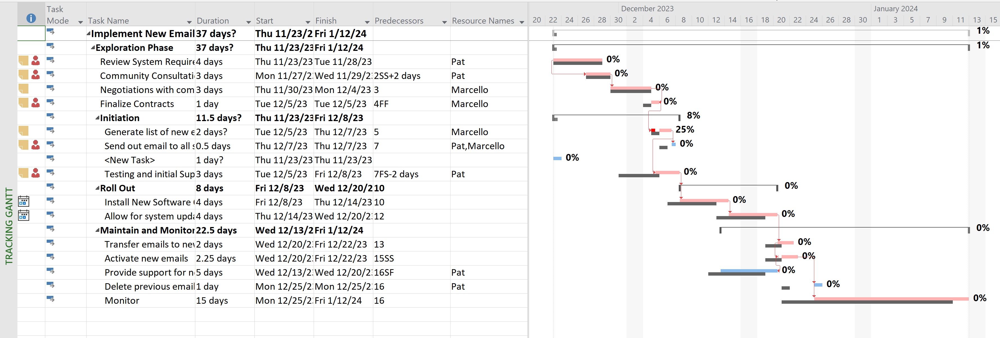
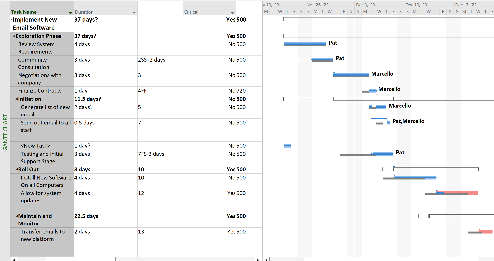
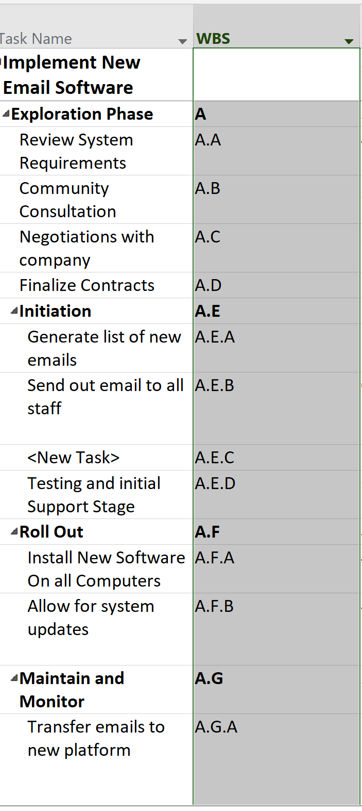

# Project Management for IT

This course was designed to take you from a foundational understanding of what a project is to mastering the complex technical and interpersonal skills required to lead IT initiatives.

Here is a comprehensive breakdown of the major lessons and topics covered each week, as detailed in your course materials:

## Wk 1: Introduction to Project Management

* **Definition:** A project is a **temporary endeavor** undertaken to create a **unique product, service, or result** (PMBOK). It is a "problem scheduled for solution."
* **The Lifecycle:** You learned the five process groups: Initiation, Planning, Executing, Monitoring/Control, and Closing.
* **The Triple Constraint:** The fundamental balance of **Scope, Time, and Cost**. If one changes, the others are affected.

## Wk 2: Scope Management

* **Defining the Work:** Scope management ensures the project includes *only* the work required.
* **Boundaries:** It involves creating a Scope Statement to define project boundaries and prevent "scope creep" (uncontrolled changes).

## Wk 3: Success and Failures

* **Project Assumptions:** You learned that vague assumptions are dangerous. You practiced turning them into "Best Stated" assumptions:
* *Vague:* "Management will support the project."
* *Best Stated:* "The VP of Finance will allocate $100,000 from their budget by June 30."

* **Why IT Projects Fail:** Often due to a lack of user input, incomplete requirements, or changing specifications.

## Wk 4: Schedule and Tasks

* **Network Diagrams:** You explored how tasks relate to each other using:
* **AON (Activity on Node):** Boxes represent work, arrows represent flow.
* **AOA (Activity on Arrow):** Arrows represent work.

* **Critical Path:** Identifying the sequence of tasks that represents the longest path through a project, determining the shortest possible duration.

## Wk 5: Personal Time Management

* **Pareto Principle (80/20 Rule):** 80% of value is often contained in 20% of the work.
* **Urgent vs. Important:** Triage involves separating "Urgent" tasks (crisis-driven) from "Important" tasks (goal-driven).
* **POSEC Hierarchy:** A model for personal productivity—**P**rioritize, **O**rganize, **S**treamline, **E**conomize, and **C**ontributing.

## Wk 6: WBS and PMBOK

* **Work Breakdown Structure (WBS):** The hierarchical decomposition of the total scope of work. It turns a project into manageable "work packages."
* **PMBOK:** You used the Project Management Body of Knowledge as the global standard for these processes.

## Wk 7: Cost Management

* **Estimating Methods:** 
* **Analogous:** Comparing to a similar past project.
* **Parametric:** Using math (e.g., $100/sq. ft).
* **Bottom-up:** Summing detailed task costs.

* **Earned Value Management (EVM):** Using formulas to track project health:
* **CV (Cost Variance):**  (Positive = under budget).
* **CPI (Cost Performance Index):**  (Shows cents of value gained per dollar spent).

## Wk 8: Communications Management

* **The 90% Rule:** Communication is roughly 90% of a Project Manager's job.
* **Communication Channels:** You used the formula **** to show how complexity grows exponentially as team size () increases.
* **Leadership vs. Management:** Leadership asks "Why?" and builds vision; Management asks "How/When?" and focuses on efficiency.

## Wk 9: Work Duration and Quality

* **The Golden Formula:** . This is the engine behind MS Project scheduling.
* **Quality Management:** The goal is to satisfy "stated or implied needs."
* **Quality Tools:**
* **Pareto Analysis:** Identifying the "vital few" problems.
* **Cause and Effect (Ishikawa/Fishbone):** Finding the root cause of errors.

## Wk 10: Leveling

* **Resource Leveling:** The process of resolving over-allocations by delaying tasks or splitting work based on resource availability.
* **Split Tasks:** A technical result in MS Project where work is paused and resumed later to accommodate a resource's schedule.

## Wk 11: Risk Management

* **Goal:** To move uncertainty away from "Risk" (negative) and toward "Opportunity" (positive).
* **Risk Responses:**
1. **Avoidance:** Changing the plan to eliminate the risk.
2. **Transference:** Shifting impact to a third party (e.g., insurance).
3. **Mitigation:** Reducing probability or impact.
4. **Acceptance:** Dealing with the risk if it occurs.

## Wk 12: Human Resources (HR)

* **The Tuckman Model:** The five stages of team development: **Forming, Storming, Norming, Performing, and Adjourning.**

* **Stakeholder Analysis:** Identifying who needs what information and how to manage their expectations.

## Wk 13: Project Accounting & Personal Finance

* **CAPEX vs. OPEX:** 
* **Capital Expense:** Funds used to acquire physical assets (e.g., a new server).
* **Operational Expense:** Ongoing costs to run the business (e.g., rent, heat).

* **Depreciation:** The accounting method used to turn Capital Assets into Operational Expenses over their useful life.
* **Budgeting:** Applying these principles to determine if an IT investment (like a password reset app) is a "good investment" based on cost savings vs. implementation costs.

## Final Assignment: Microsoft Project Implementation

The final assignment provided an opportunity to demonstrate practical mastery of Microsoft Project by building a complete project schedule for implementing a new email software system. This hands-on project integrated concepts from across all 13 weeks of the course, showcasing how theoretical knowledge translates into real-world project management tools.

### Project Overview: Implement New Email Software

The assignment required developing a comprehensive project schedule with 19 tasks spanning approximately 37 days, from November 23, 2023, to January 12, 2024. The project covered the full lifecycle from exploration and requirements gathering through implementation, testing, and ongoing maintenance.

*Complete project schedule showing all tasks, dependencies, and timeline*

### Key Demonstrations

#### 1. Gantt Chart Development and Predecessor Dependencies

I created a dynamic Gantt chart demonstrating all four dependency types:

* **Finish-to-Start (FS):** Standard sequential dependencies, such as Task 4 (Negotiations) following Task 3 (Community Consultation)
* **Start-to-Start (SS):** Tasks beginning simultaneously with a lag, like Task 3 starting 2 days after Task 2 begins (2SS+2 days)
* **Finish-to-Finish (FF):** Tasks completing together, demonstrated with Task 5 (Finalize Contracts) finishing when Task 4 finishes (4FF)
* **Start-to-Finish (SF):** Less common but critical for certain scenarios, shown with Task 17 (Provide support) starting when Task 16 finishes (16SF)

I also implemented both positive and negative lags:
* **Positive Lag (+2 days):** Task 3 starting 2 days after Task 2 begins
* **Negative Lag (-2 days):** Task 10 starting 2 days before Task 7 finishes (7FS-2 days), allowing for parallel work and schedule compression

Tasks were strategically designed so that not all tasks were on the critical path, demonstrating understanding of float and non-critical activities.

*Gantt chart view highlighting the four dependency types (FS, SS, FF, SF) with positive and negative lags*

#### 2. Resource Management and Cost Control

**Resource Setup:**
* Added myself (Marcello) as a resource with a standard rate
* Assigned myself to three critical tasks to demonstrate resource allocation
* Created Pat, a junior resource at $15/hour, assigned to non-critical path tasks to optimize costs

**Work, Units, and Duration Concepts:**
* Task 9 was set as **Fixed Work**, demonstrating the relationship: Work = Duration × Units
* By doubling the resources (adding a second person), the duration was automatically halved while work remained constant—a practical demonstration of how resource allocation affects timeline

*Resource view showing Marcello assigned to critical tasks and Pat assigned to non-critical path tasks*

#### 3. Baseline Management and Change Control

I established an initial baseline for both duration and cost, which was graphically displayed on the Gantt chart. This baseline served as the original plan against which all changes would be measured.

*Gantt chart showing baseline bars (gray) compared to current schedule (blue), demonstrating baseline tracking*

**Task 8 Critical Path Exercise:**
* Task 8 ("Send out email to all staff") was set to 0.5 days and positioned on the critical path
* Set the task to 50% complete (half done)
* Created a new baseline to capture this progress state
* Then modified the task duration to add one extra day (changing from 0.5 to 1.5 days), with the revised task still showing 50% completion
* This demonstrated how baselines track original plans while allowing for schedule updates and progress tracking

*Close-up view of Task 8 showing critical path highlighting, 50% progress indicator, and baseline comparison*

#### 4. Risk Management Application

I documented risk strategies for tasks 3, 4, 5, and 6, each using a different risk response type:

* **Task 3 - Avoidance:** Risk strategy focused on eliminating potential issues through early community consultation
* **Task 4 - Transference:** Risk transferred to the vendor through contract negotiations
* **Task 5 - Mitigation:** Risk reduced through careful contract finalization processes
* **Task 6 - Acceptance:** Risk acknowledged and contingency plans prepared for the initiation phase

This demonstrated practical application of Week 11's risk management concepts, showing how different risks require different response strategies.

#### 5. Cost Estimation Methods

Tasks 8, 9, and 10 each demonstrated a different estimating method:

* **Task 8 - Analogous Estimating:** Duration estimated by comparing to similar email rollout projects completed in the past
* **Task 9 - Parametric Estimating:** Cost or duration calculated using a mathematical model (e.g., cost per user or time per unit)
* **Task 10 - Bottom-Up Estimating:** Detailed breakdown of testing activities, with individual component estimates summed to create the total

This showcased Week 7's cost management concepts in a practical context.

#### 6. Work Breakdown Structure (WBS)

I created a hierarchical WBS structure with multiple levels:

* **Level 1:** Main project summary ("Implement New Email Software")
* **Level 2:** Major phases including "Exploration Phase," "Initiation," "Roll Out," and "Maintain and Monitor"
* **Level 3:** Detailed tasks within each phase (e.g., 1.1.1, 1.1.2)

Task 11 ("Roll Out") served as a summary task for tasks 12 and 13, demonstrating parent-child relationships in the WBS hierarchy. Tasks 12 and 13 contained detailed work packages with specific durations, resources, and dependencies.

The WBS numbering scheme was customized to show the hierarchical structure clearly, demonstrating mastery of Week 6's WBS concepts.

*WBS view showing hierarchical task structure with multiple levels (1, 1.1, 1.1.1) and summary tasks*

#### 7. Resource Leveling and Split Tasks

Using Microsoft Project's leveling feature, I resolved resource overallocations by creating split tasks. This demonstrated Week 10's leveling concepts:

* **Resource Leveling:** Automatically adjusted task schedules to resolve conflicts when resources were overallocated
* **Split Tasks:** Work was paused and resumed later to accommodate resource availability, visible in the Gantt chart as tasks with gaps in their timeline bars

This showed practical understanding of how to balance resource constraints with project timelines.

*Gantt chart showing a split task with a visible gap in the timeline bar, demonstrating how work was paused and resumed to accommodate resource availability*

### Integration of Course Concepts

This assignment successfully integrated concepts from every major topic:

* **Week 1:** Project lifecycle phases (Initiation, Planning, Executing, Monitoring/Control, Closing)
* **Week 2:** Scope boundaries preventing scope creep
* **Week 4:** Network diagrams, critical path analysis, and task dependencies
* **Week 6:** Work Breakdown Structure hierarchy
* **Week 7:** Multiple cost estimation methods
* **Week 9:** Work, Duration, and Units relationships (the Golden Formula)
* **Week 10:** Resource leveling and split tasks
* **Week 11:** All four risk response strategies
* **Week 13:** Resource cost management (comparing senior vs. junior resource rates)

### Reflection

This assignment demonstrated that effective project management requires more than theoretical knowledge—it demands the ability to use professional tools like Microsoft Project to translate concepts into actionable schedules. By building a complete project plan with realistic dependencies, resources, baselines, and risk strategies, I gained practical experience in managing the triple constraint (Scope, Time, Cost) while navigating the complexities of real-world IT project implementation.

The project highlighted how Microsoft Project serves as the "engine" behind project scheduling (Week 9's Golden Formula), automatically calculating critical paths, resource allocations, and schedule impacts when changes occur. This hands-on experience reinforced the course material and provided confidence in using industry-standard project management software.
