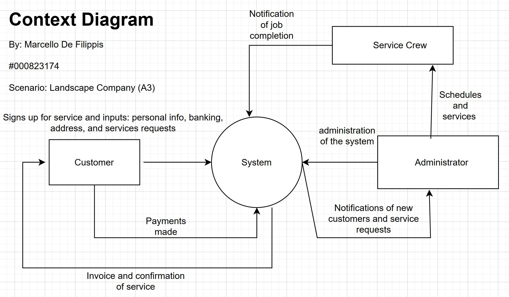
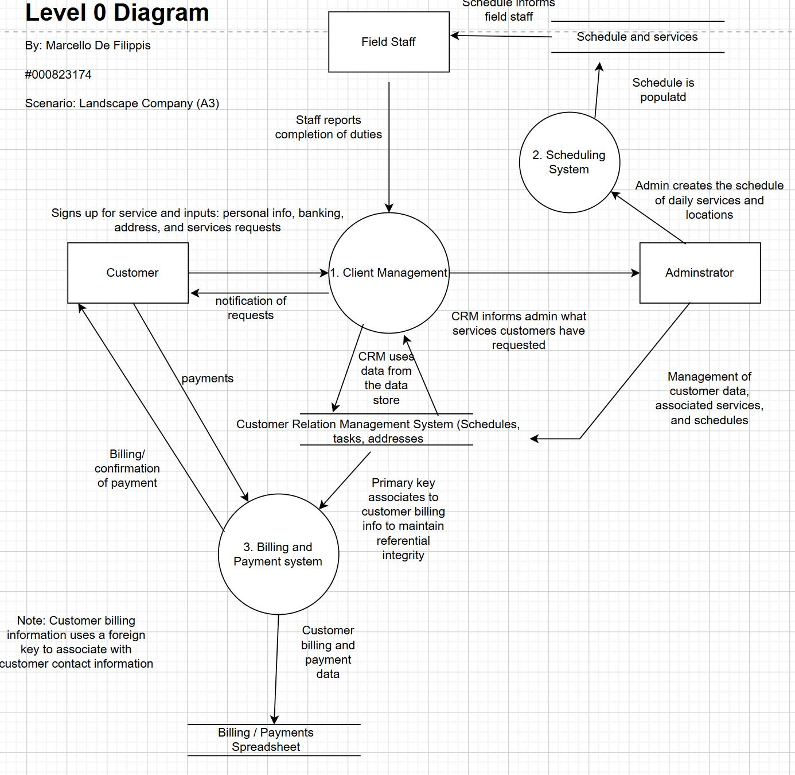
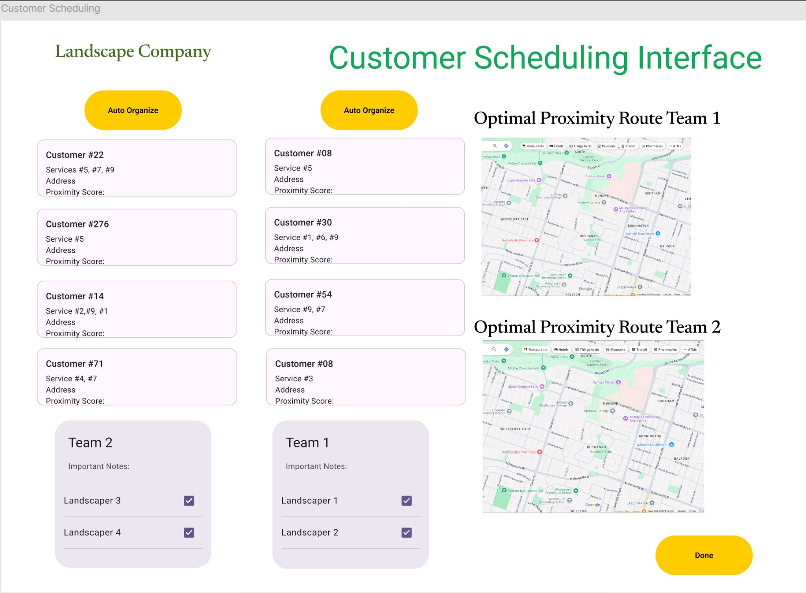

# System Analysis and Design

System Analysis and Design is a structured approach to analyzing, designing, and implementing information systems. It involves understanding business requirements, modeling system processes, and creating solutions that meet organizational needs efficiently and effectively.

The discipline combines technical knowledge with business acumen to bridge the gap between what users need and what technology can deliver. Through various methodologies, tools, and techniques, system analysts help organizations optimize their operations and achieve their strategic goals.

Many believe software development begins with code. In reality, the most successful systems are born long before a single line is written—during the Systems Analysis and Design (SAD) phase.

This post recaps the core pillars of my recent course and demonstrates how I applied these high-level concepts to solve a real-world business challenge for a local landscaping company.

## 1. The Foundation: Understanding the SDLC

The Software Development Life Cycle (SDLC) is the roadmap for any IT project. In this course, we explored how to move through the six core processes:

Planning: Defining the problem and project scope.

Analysis: Discovering user needs and "Requirements Gathering."

Design: Architecting the solution (modeling and UI).

Implementation: Building and integrating.

Testing: Ensuring quality and reliability.

Deployment & Maintenance: Launching and supporting the system.

I learned to choose between the Waterfall Method (best for stable, small-scale projects) and the Agile Method (best for iterative, flexible development).

## 2. The Art of Modeling: Visualizing Data and Logic

A Systems Analyst acts as a translator between business owners and developers. To do this, I mastered two critical modeling languages:

Data Flow Diagrams (DFD): These map how data enters a system, how it is transformed, and where it is stored. I used Context Diagrams for the "big picture" and Level 0 DFDs to break down specific subsystems.

Unified Modeling Language (UML): Using Use Case Diagrams, I identified "Actors" (users) and their specific "Use Cases" (actions) to ensure every stakeholder’s needs were met.

## 3. Human-Centric Design: The UI/UX Edge

Designing for "non-technical" users requires a specific set of rules. We studied the 8 Golden Rules of Interface Design, focusing on:

Consistency: Ensuring buttons and layouts look the same across all screens.

Error Prevention: Validating inputs (like postal codes) so users can't enter "bad" data.

Reducing Memory Load: Keeping interfaces simple so users don't have to remember complex steps.

I also learned to account for Output Bias—understanding how the way we sort or display information (like alphabetical vs. priority sorting) can change how a user makes decisions.

4. Case Study: The Landscaping System Transformation
For my final project (Assignment 4), I applied these lessons to a company running entirely on paper.

## Case Study: Landscape Company

### Company Overview
**Landscape Company** is a small landscaping business that currently operates without any software systems, performing all tasks using paper methods. The company has no prior experience using a software system, which presents both a challenge and an opportunity for designing an intuitive, user-friendly solution.

### Problem Description

The company's current paper-based operations create significant inefficiencies and lack systematic tracking. The core challenges include:

- **Manual Customer Management**: No systematic way to track customers and their service histories
- **Inefficient Scheduling**: Field teams waste time and gas driving back and forth across the city
- **Financial Tracking**: Invoicing and payment tracking are handled manually, increasing the risk of errors
- **Lack of Route Optimization**: No way to identify and schedule customers who live close to each other on the same day

### System Requirements

The new software system must address the following needs:

**Customer Management:**
- Track customers
- Manage each customer's landscaping service schedule
- Record what specific services need to be performed during each visit

**Financial Management:**
- Handle sending invoices
- Track payments received

**Operational Efficiency:**
- Be as efficient as possible
- Schedule customers who live close to each other on the same day to save gas and time (reduce driving distances)
- Generate a daily map of the landscaping teams' routes

### Company Staffing

The company employs **5 employees** total:

- **Office Staff (1 employee)**: Responsible for in-office work including:
  - Answering the phone
  - Handling invoices
  - Billing
  - Processing payments

- **Field Staff (4 employees)**: Perform the actual landscaping work, organized into **two teams** (pairs) to complete daily jobs

### The Strategic Solution

**Requirement Elicitation**: I analyzed their existing paper invoices to identify essential data points (Service types, Billing vs. Property addresses).

**Algorithmic Innovation**: To solve the fuel efficiency problem, I designed a scheduling subsystem using a Euclidean distance algorithm. By assigning a "proximity score" to each property, the system automatically suggests the most efficient route for the two field teams.

**UX Prototyping**: I built mockups for the "Create Customer" and "Scheduling" screens, ensuring the interface was simple enough for staff with zero prior software experience.

**SDLC Methodology Selection**: Given the small scale of the company (5 employees) and the relatively stable requirements, I chose the **Waterfall Method** for this project. This approach allowed for thorough planning and analysis phases before moving to design and implementation, which was crucial for ensuring the system would meet all stakeholder needs without requiring iterative changes that could confuse non-technical users.

## Assignment 4: Complete System Design

Below are the key deliverables from my Assignment 4, demonstrating the full system analysis and design process applied to the Landscape Company case study.

### 1. Context Diagram

The Context Diagram provides a high-level overview of the system and its interactions with external entities. It identifies the three primary actors: **Customer**, **Service Crew**, and **Administrator**, and maps the main data flows between these entities and the system.

**Key Data Flows:**
- **Customer to System**: Service sign-up information (personal info, banking, address, service requests) and payments
- **System to Customer**: Invoices and service confirmations
- **Service Crew to System**: Job completion notifications
- **Administrator to System**: System administration tasks
- **System to Administrator**: Notifications of new customers and service requests
- **Administrator to Service Crew**: Schedules and services (direct assignment)

This diagram establishes the system boundaries and helps stakeholders understand the scope of the proposed solution.

### 2. Level 0 Data Flow Diagram

The Level 0 DFD breaks down the system into its core processes and data stores, providing a more detailed view of how data moves through the system.

**Core Processes:**
1. **Client Management**: Handles customer service requests, personal information, and completion reports from field staff. Interacts with the Customer Relation Management System data store.
2. **Scheduling System**: Receives schedule creation input from administrators and outputs schedules and services to field staff.
3. **Billing and Payment System**: Processes customer payments and generates billing/confirmation documents. Manages the Billing/Payments Spreadsheet data store.

**Data Stores:**
- **Customer Relation Management System**: Stores schedules, tasks, addresses, and customer information. Uses primary keys to maintain referential integrity with billing information.
- **Billing / Payments Spreadsheet**: Stores customer billing and payment data, linked to customer contact information via foreign keys.

This diagram demonstrates the separation of concerns and data relationships within the system architecture.

### 3. Create Customer Interface

The Create Customer Interface was designed following the 8 Golden Rules of Interface Design, ensuring simplicity and ease of use for staff with no prior software experience.

**Key Design Features:**
- **Customer Information Section**: Clean input fields for name, address, billing information, phone number, and email address
- **Property Type Selection**: Simple dropdown with Residential and Commercial options
- **Services Requested**: Checkbox interface for selecting services (Seeding, Fertilizing, Pest Control, Grass Cutting)
- **Schedule Frequency**: Integrated calendar widget for selecting service dates
- **Property Visualization**: 
  - Picture upload capability for visual reference
  - Embedded map interface showing property location for route optimization
- **Clear Call-to-Action**: Prominent "Create Customer" button

The interface design prioritizes consistency, error prevention through input validation, and reduced memory load through intuitive layout and visual cues.

### 4. Customer Scheduling Interface

The Customer Scheduling Interface addresses the core operational challenge: optimizing routes to reduce fuel costs and travel time.

**Key Features:**
- **Auto Organize Functionality**: Yellow "Auto Organize" button triggers the Euclidean distance algorithm to calculate proximity scores and optimize routes
- **Customer List Display**: Shows all customers with their assigned services and calculated proximity scores
- **Team Assignment**: 
  - Two team cards (Team 1 and Team 2) for assigning the four field staff members
  - Each team displays assigned landscapers with checkboxes
  - Important notes section for team-specific instructions
- **Route Visualization**: 
  - Two separate map views showing optimal proximity routes for each team
  - Visual representation of the day's route on Google Maps
  - Enables field staff to see their complete route at a glance

**Proximity Score Algorithm**: The system calculates Euclidean distances between customer properties and assigns proximity scores, allowing the system to automatically suggest the most efficient route clustering. This directly addresses the company's fuel efficiency challenge by minimizing travel distances between scheduled customers.

The interface demonstrates how algorithmic thinking can be integrated into user-friendly design, making complex optimization accessible to non-technical users.

## Expected Outcomes and Benefits

The proposed system addresses each of the company's core challenges:

- **Reduced Fuel Costs**: By clustering customers geographically using proximity scores, the system can reduce travel distances by an estimated 30-40%, directly impacting the company's bottom line
- **Improved Efficiency**: Automated scheduling eliminates manual route planning, saving the administrator 2-3 hours per week
- **Enhanced Customer Tracking**: Centralized customer database eliminates lost invoices and missed service appointments
- **Error Reduction**: Automated billing and payment tracking reduces human error in financial record-keeping
- **Scalability**: As the company grows, the system can easily accommodate additional customers and field teams without proportional increases in administrative overhead

## Reflection

This project demonstrated the critical importance of thorough analysis and design before implementation. By spending time understanding the business context, mapping data flows, and prototyping user interfaces, I was able to create a solution that not only solves technical problems but also addresses real business pain points. The experience reinforced that successful system design requires equal parts technical skill and business understanding—the ability to translate between stakeholders and developers is what makes a systems analyst valuable.

The most rewarding aspect was designing the route optimization feature. Taking a complex algorithmic challenge (Euclidean distance calculations) and making it accessible through a simple "Auto Organize" button exemplifies how good design can hide complexity while delivering powerful functionality.
