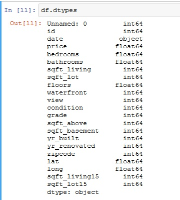
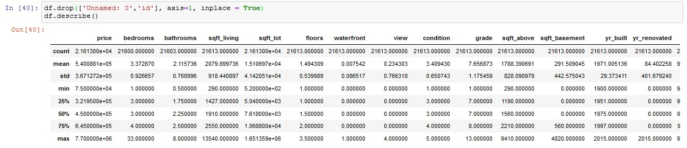
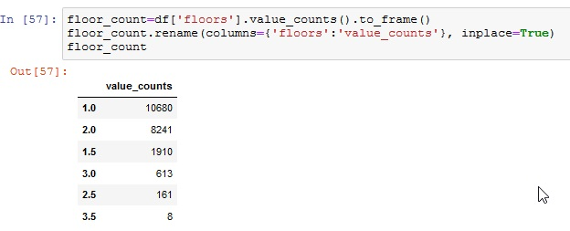
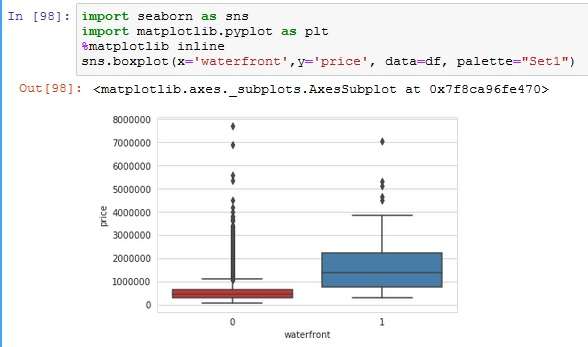
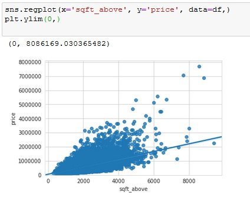
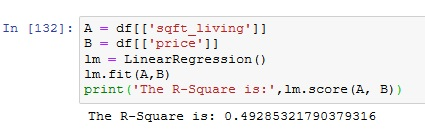
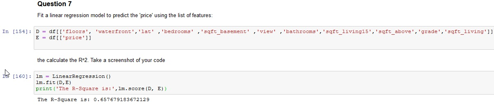
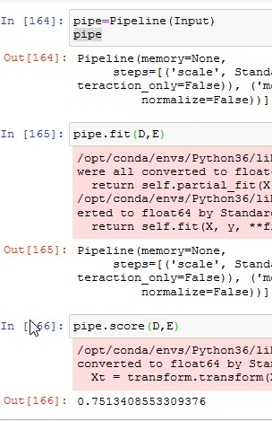
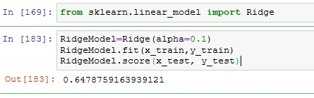
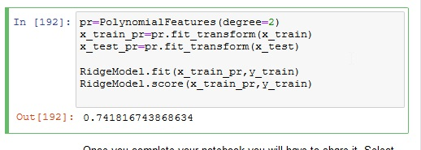

<h1> Data Analysis Project: House Sales in King County, USA </h1>

For this assignment, I used python to analyze and predict housing prices using attributes and features such as square footage, number of bedrooms, number of floors and so on.

Here is the dataset: <a href="https://s3-api.us-geo.objectstorage.softlayer.net/cf-courses-data/CognitiveClass/DA0101EN/coursera/project/kc_house_data_NaN.csv">House Sales in King County, USA</a>

This report provides details of our attempt to predict house prices using various regression methods. I will make use of data of house prices in King County, Washington State, USA for sales in 2014 and 2015.

Our main, predictive question is:&ldquo;Is it possible to predict the sale price of a house from information about that house such as the size, number of bedrooms, condition etc?&rdquo;

<h2>The Dataset </h2>

 The dataset contains house sale prices for King County, which includes Seattle. It includes home sold between May 2014 and May 2015

<b>id </b>:a notation for a house

 <b>date</b>: Date house was sold

<b>price</b>: Price is prediction target

<b>bedrooms</b>: Number of Bedrooms/House

<b>bathrooms</b>: Number of bathrooms/bedrooms

<b>sqft_living</b>: square footage of the home

<b>sqft_lot</b>: square footage of the lot

<b>floors </b>:Total floors (levels) in house

<b>waterfront</b>: House which has a view to a waterfront

<b>view</b>: Has been viewed

<b>condition</b>: :How good the condition is Overall

<b>grade</b>: overall grade given to the housing unit, based on King County grading system

<b>sqft_above </b>:square footage of house apart from basement

<b>sqft_basement</b>: square footage of the basement

<b>yr_built</b>: Built Year

<b>yr_renovated </b>:Year when house was renovated

<b>zipcode</b>:zip code

<b>lat:</b> Latitude coordinate

<b>long</b>: Longitude coordinate

<b>sqft_living15</b>: Living room area in 2015 (implies-- some renovations) This might or might not have affected the lotsize area

<b> sqft_lot15 </b>: lotSize area in 2015 (implies-- some renovations)

<h2> The Questions </h2>

<u>Question 1: </u> Display the data types of each column using the attribute dtype, then take a screenshot and submit it, include your code in the image.

<u>Question 2: </u>Drop the columns &quot;id&quot; and &quot;Unnamed: 0&quot; from axis 1 using the method drop(), then use the method describe() to obtain a statistical summary of the data.

<u>Question 3: </u>use the method value_counts to count the number of houses with unique floor values, use the method .to_frame() to convert it to a dataframe.

<u>Question 4: </u> use the function boxplot in the seaborn library to produce a plot that can be used to determine whether houses with a waterfront view or without a waterfront view have more price outliers.

<u>Question 5:</u>  Use the function regplot in the seaborn library to determine if the feature sqft_above is negatively or positively correlated with price

<u>Question 6: </u> Fit a linear regression model to predict the price using the feature 'sqft_living' then calculate the R^2. Take a screenshot of your code and the value of the R^2.

<u> Question 7:  </u>Fit a linear regression model to predict the 'price' using the list of features: 
&bull; &quot;floors&quot; 
&bull; &quot;waterfront&quot; 
&bull; &quot;lat&quot; 
&bull; &quot;bedrooms&quot; 
&bull; &quot;sqft_basement&quot; 
&bull; &quot;view&quot; 
&bull; &quot;bathrooms&quot; 
&bull; &quot;sqft_living15&quot; 
&bull; &quot;sqft_above&quot; 
&bull; &quot;grade&quot; 
&bull; &quot;sqft_living&quot;

<u>Question 8: </u> Create a pipeline object that scales the data performs a polynomial transform and fits a linear regression model. Fit the object using the features in the question above, then fit the model and calculate the R^2. Take a screenshot of your code and the R^2.

<u>Question 9: </u> Create and fit a Ridge regression object using the training data, setting the regularization parameter to 0.1 and calculate the R^2 using the test data. Take a screenshot for your code and the R^2

<u>Question 10: </u>Perform a second order polynomial transform on both the training data and testing data. Create and fit a Ridge regression object using the training data, setting the regularisation parameter to 0.1. Calculate the R^2 utilising the test data provided. Take a screenshot of your code and the R^2.

 
 End- Thank you for reading 

