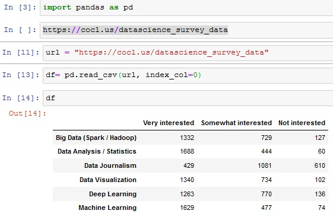
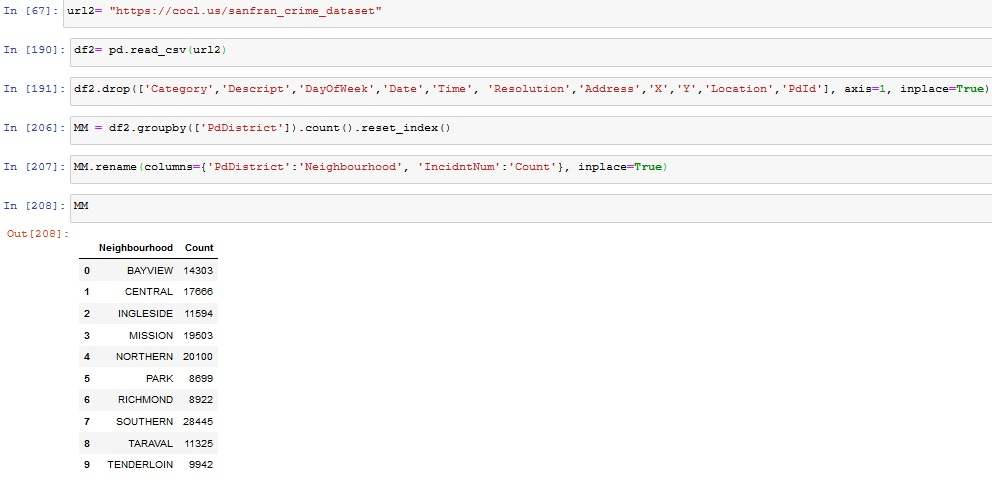
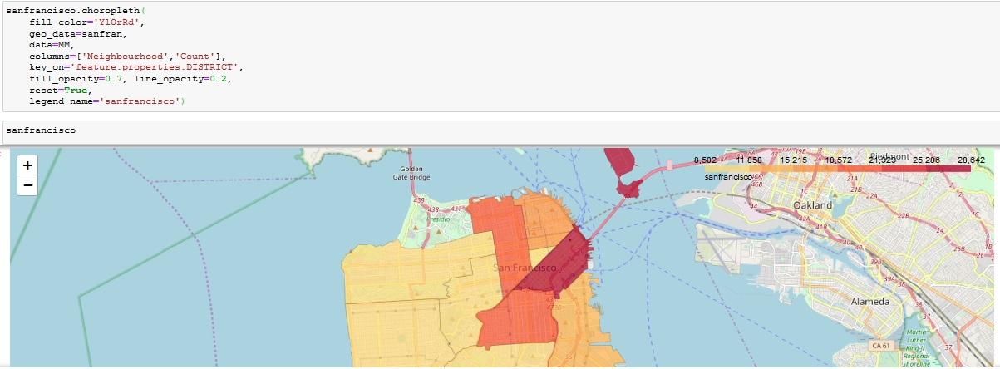

<h1>Data Visualization Project (IBM Data Science Certification)</h1>

For this project I was tasked with demonstrating  data visualization skills primarily using Matplotlib. Two visualization plots were required for this project: the first one is a plot summarizing the results of a survey that was conducted to gauge an audience interest in different data science topics. The second plot is a Choropleth map of the crime rate in the city of San Francisco.

A survey was conducted to gauge an audience interest in different data science topics, namely:

<ol>
<li>Big Data (Spark / Hadoop)</li>
<li> Data Analysis / Statistics</li>
<li> Data Journalism</li>
<li> Data Visualization</li>
<li>Deep Learning</li>
<li>Machine Learning</li>
</ol>

The participants had three options for each topic: Very Interested, Somewhat interested, and Not interested. 2,233 respondents completed the survey. 
The survey results have been saved in a csv file and can be accessed through this  <a href="https://cocl.us/datascience_survey_data">link</a> 
If you examine the csv file, you will find that the first column represents the data science topics and the first row represents the choices for each topic.

<h3> Step One: Read the file into a pandas dataframe </h3>
 

 
<h3> Step Two: </h3>
Use the artist layer of Matplotlib to create a bar chart with the percentage of the respondents' interest in the different data science topics surveyed.

<ol>
<li> Sort the dataframe in descending order of Very interested.</li>
<li>Convert the numbers into percentages of the total number of respondents. Recall that 2,233 respondents completed the survey. Round percentages to 2 decimal places.</li>
<li> As for the chart implement the following styling:</li>
</ol>
<ul>
<li> use a figure size of (20, 8),</li>
<li> bar width of 0.8</li>
<li> use color #5cb85c for the Very interested bars, color #5bc0de for the Somewhat interested bars, and color #d9534f for the Not interested bars.</li>
<li> use font size 14 for the bar labels, percentages, and legend</li>
<li> use font size 16 for the title, and,</li>
<li> display the percentages above the bars as shown above, and remove the left, top, and right borders.</li>

 
<image src="Ibmdataviz/2.jpg" alt="Bar Chart" width="500" height="300">

 
<h3>Step Three: Create a Choropleth map to visualize crime in San Francisco to represent the total number of crimes in each neighborhood.</h3>

 The dataset can be found <a href="https://cocl.us/sanfran_crime_dataset"> Here</a>

 

First, restructure the data so that it is in the right format for the Choropleth map. You will need to create a dataframe that lists each neighborhood in San Francisco along with the corresponding total number of crimes. 
Based on the San Francisco crime dataset, you will find that San Francisco consists of 10 main neighborhoods, namely:

<ul>
<li> Central</li>
<li> Southern</li>
<li> Bayview</li>
<li> Mission</li>
<li>Park</li>
<li> Richmond</li>
<li>Ingleside</li>
<li>Taraval</li>
<li>Northern</li>
<li> Tenderloin</li>
</ul>
 

<!--  -->
<image src="Ibmdataviz/3.jpg" alt="Bar Chart" width="500" height="300">
 

Second,
We will need a GeoJSON file that marks the boundaries of the different neighborhoods in San Francisco. In order to save you the hassle of looking for the right file, I already downloaded it for you and I am making it available via this <a href="https://cocl.us/sanfran_geojson">Link</a> 
 

<!--  -->
<image src="Ibmdataviz/4.jpg" alt="Bar Chart" width="500" height="300">
