In the month of April 2022 I was just finishing up my second semester of my Software Development program and with summer coming up I applied to various internship positions. Having previous Data Science experience, I was selected to complete a take-home assignment as part of the interview process for the position of ‘Data Analyst Intern’. <b> This is a record of what the assignment entailed, the questions it asked, and my answers that landed me the position <b>.

_<i>Please note: The dataset provided alongside the assignment states explicitly that the data is completely fictious.</i> _

The dataset contained 830 records each containing 5 columns of data.

The Field Columns were as follows:

<table>
  <tr>
    <th>Field</th>
    <th>Explanation</th>
  </tr>
  <tr>
    <td>company_name</td>
    <td> The fictitious name of the company inspected.  </td>
  </tr>
  <tr>
    <td>company_food_risk_category </td>
    <td>   A level of risk associated with the company. </td>
  </tr>
  <tr>
  <td> inspection_date </td>
  <td>  The date that the fictitious inspection took place. </td>
  </tr>
  <tr>
  <td> infraction_weight </td>
  <td>  The level of severity associated with an infraction. Larger values represent </td>

  </tr>s

</table>

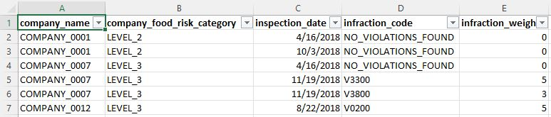

<h2>Assignment Questions</h2>
 
<h3>Question Set 1</h3>

There are some data quality issues in the <b>infraction_weight</b> column . Find them and answer the following questions. 

<ol>
<li> How many did you find? </li>
<li> What are they? </li>
<li> Describe in a sentence or two, how you found them. </li>
<li> Describe in a sentence or two, one possible way to fix the issues you found. </li>
</ol>

<h3>Question Set 2</h3>

The <b>infraction_code</b> column uses a placeholder value when an inspector finds no infractions during their inspection. Find them and answer the questions below. 

<ol>
<li> What is the placeholder they used? </li>
<li> Describe in a sentence or two, how you determined this. </li>
</ol>

<h3>Question Set 3</h3>

 The <b>company_food_risk_category</B> column contains a set of values: LEVEL_1, LEVEL_2, LEVEL_3. It is noteworthy that those values are loosely connected to the number of infractions found during inspections and to the severity of each infraction. What other interesting patterns, grouping or trends can you find in the data? 

<ol>
<li>a. Describe in a sentence or two, one noteworthy or interesting pattern, grouping or trend that you see in the data.  </li>
<li> Describe in a sentence or two, how you discovered that one noteworthy item. </li>
<li>  If you have experience with summarizing data using pivot tables, functions, programming languages (e.g. SQL, R, Python, VBA) or other software packages, choose exactly one output (a screenshot is fine) from your tool of choice to support your noteworthy discovery. </li>
<li> If you have experience with visualizing data using graphs, charts, infographics, choose exactly one output (a screenshot is fine) from your </li>
</ol>

 
<h2> Here is my approach and how I answered each question that landed me the position </h2>
 

I received the dataset in .xlsx format so I naturally start by opening it with Microsoft Excel.

I find a good practice when receiving a new dataset is it  ‘unhide’ any data that may have been ‘hidden’ by the previous user.

Unhide any hidden rows or columns

Another thing I like to do when I am given a dataset is to format the dataset as a table so that I can maintain the integrity of the data.

Once my data is in a format that I can work with I then conduct ‘Exploratory Data Analysis’ which helps me visually see ‘what my data is doing’ and get to know my data a bit better. This also helps with the data cleaning process. I can take my dataset into a program called ‘Open Refine’ and visually see what my data is doing. Here for example, I can see that some numbers are type numerically and some are entered as text. 

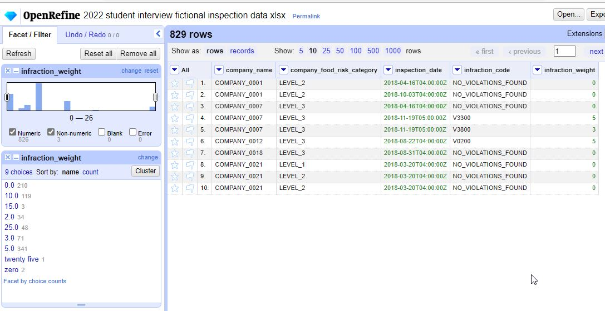

I will save my excel file in .csv format so that I can work with it in Python; or more particularly, Jupyter Notebook and conduct some more EDA and Data Cleaning.

 
 Let's see what the data types are that we are working with

 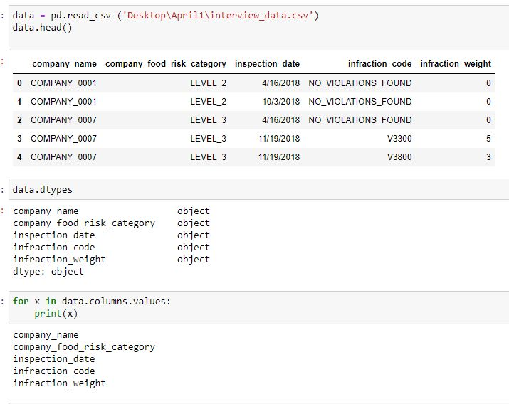

 
Second I want to see if there are any <i>NaN</i> data types or missing values.

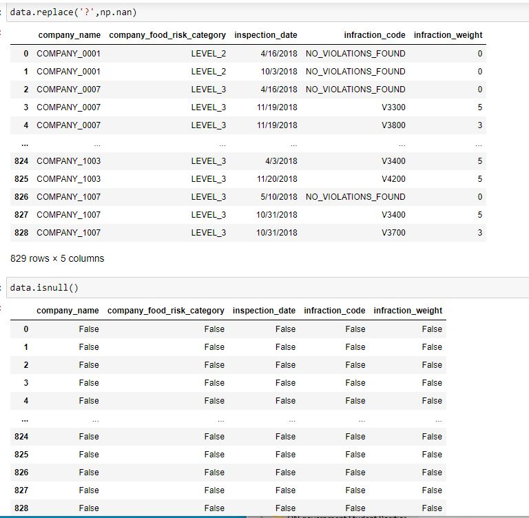

 
Lastly, I want to see that there is nothing spelled wrong or out of place, that all my ‘unique values’ are what I expect them to be. 

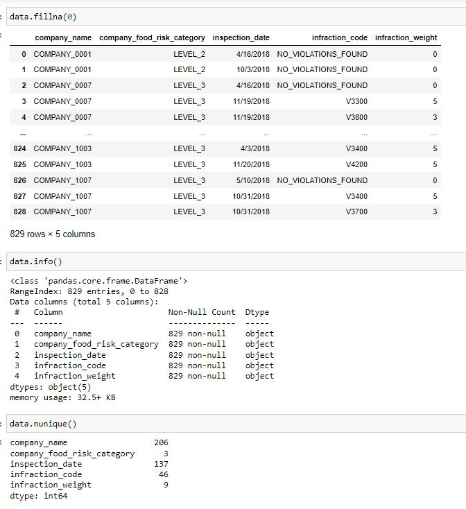

 <h2> Now let's answer those questions </h2>
  

 <h3>Question Set 1 (Answers)</h3>

1.  I found three instances of inconsistent input of the data in this column 

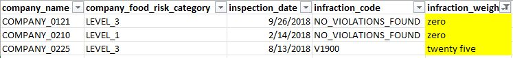

2. While the data type is mostly numeric there are three cells that are written in-text:
‘zero’
‘zero’
‘twenty five’.

 3. Using OpenRefine, I sorted through the data looking for unclean data. The software allows me to sort by ‘data types’ and while I would expect numeric data in the ‘infraction_weight’ column I can see there are outliers of an inconsistent data type; string and text. 

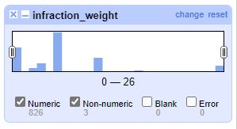

4. OpenRefine allows me to configure each problematic cell by replacing the text data with the numeric data while also changing the data type to ‘numeric’.  

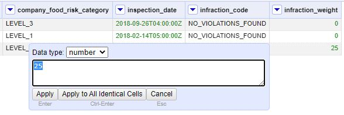 

 
<h3>Question Set 2 (Answers)</h3>

1. The placeholder used when an inspector found no infraction is inputted as 'NO_VIOLATIONS_FOUND' 

2.By examination I've simply extrapolated that the  corresponding column ‘infraction_weight’ unanimously show that there is zero infraction weight in every instance that no violation was found. Using SQL I can run a query to visually see how many instances an input of ‘NO_VIOLATIONS_FOUND’ corresponded with an infraction weight of any number other than zero and there isn’t a single instance, nor is there a single instance of any other infraction code corresponding with an infraction weight of zero. 

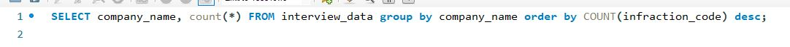
 
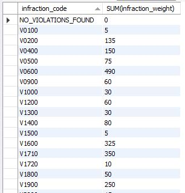 

 
<h3>Question Set 3 (Answers)</h3>

1. I wanted to find out which companies were responsible for the bulk of the violations but also factor in the weight of the violations as well to see who the biggest violators were. I found the following companies to be the top 5 violators in the data: 
<ul>
<li>Company_0788</li>
<li>Company_0309</li>
<li>Company_0945</li>
<li>Company_0206</li>
<li>Company_0122</li>
</ul>

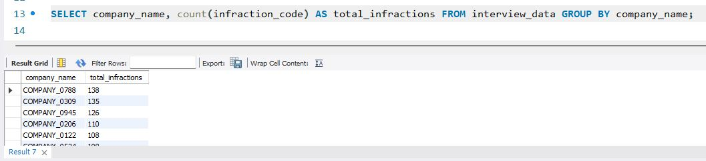

 2. Using Python’s ‘pandas’ library I created a new feature that was a simple average of the infraction weight incurred by each company, found by summing the infraction weights and dividing by that specific company’s infraction count. It was found that some companies might have had many infractions, but an overall lower infraction weight, while others had many infractions, weighing higher.

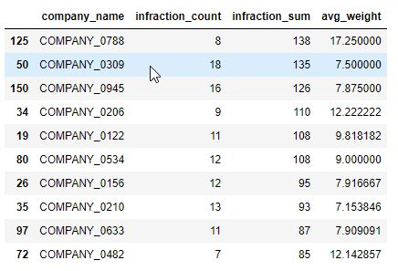

 3. Using Power B.I.: I can see that the average weight of infractions drops to its lowest in the month of July. This was done by plotting the infraction weight averages within each month in the year of 2018 found in the dataset. 

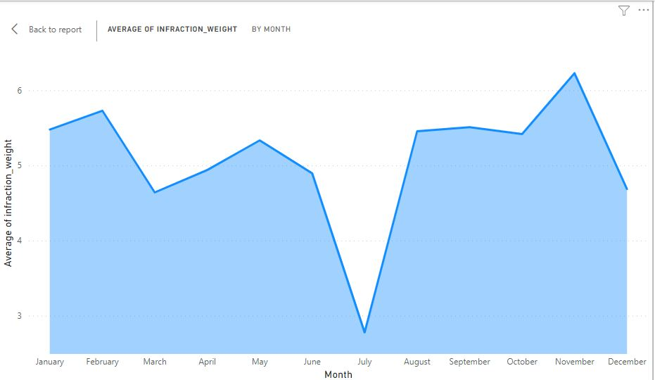

 -End- Thank you for your time. 

