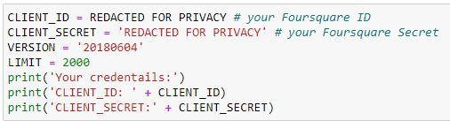

<h1> IBM Data Science Certification Capstone: Battle of the Neighbourhood </h1>

The objective of this capstone project is to implement three vital steps: leverage the Foursquare location data to explore or compare neighborhoods or cities of your choice or to come up with a problem that you can use the Foursquare location data to solve. 

 This project is approached by following three critical steps

First, by making calls to the ForeSquare API which will return a  JSON file return to us that matches our query. 

Second, Create or structure a dataframe that creates clusters or segments of your city. Use the Geocoder package to get the geographical coordinates of the postal codes in your city so that you can get the latitude and longitude coordinates of a given postal code. Input these data points onto a map using Folium. Folium allows you to create a map of any location in the world as long as you know its latitude and longitude values. 

 Third, implement k-means clustering methods in order to create cluster types around central points of our choosing. 

 
 

<h2> Introduction And Business Problem </h2>
 

In this project, I will be using foursquare location data API to locate restaurant locations and categories and utilize k-means clustering to analyze what ethnicity of restaurants exist around where I will be studying in my hometown of Hamilton,ON.  I have created beacons on my final plotted map to indicate where the post-secondary educations are in Hamilton, and the restaurant clusters that exist around these institutions.  This ‘business problem’ is really my own self project and meant for my own educational (and feeding) purposes. Perhaps once I see what types of restaurants exist around these post-secondary schools will influence where I go to study in the future.

<h2>The Data </h2>

My dataset is from the City of Hamilton, Ontario’s repository of open data for the geolocation of post-secondary school locations within the city of Hamilton. Found here:
https:/open.hamilton.ca/datasets/cccae6f029334927856da6e20a50561f_19/explore?location=43.260818%2C-79.920750%2C11.91

The post-secondary schools in the Hamilton area 

The second dataset is the list of restaurants and the categories they fall in found using the Foresquare API: https:/developer.foursquare.com

<h2>My Methodology and EDA</h2>

 First, the data was cleaned and ‘grouped’ because it was initially not worthy for analysis such as the example of the ‘categories’ as seen in the image here for example. 

Secondly, the datasets had to be parsed because they were much too large and had a lot of data that I did not require. I parsed the restaurant categories down for further analysis by using the ‘get dummies’ method as seen in the image below. 

Finally, the K-means clustering is used to perform the clustering of restaurants. My intention was to create as many clusters of as many ‘categories’ of restaurants existed in my dataset which was around 24 categories. The map itself tells the  rest of the story and is up for critique as well as interpretation.

<h2>Results </h2>

The result of this project was the map that was created at the end. The yellow points on the map indicate a post-secondary institution, which when clicked will tell you the name of the institution. The blue points indicate restaurant category clusters. As you can see here there is some accuracy as we see a cluster of bars close to the downtown post-secondary institution as an example. 

<h2>Discussion</h2>

As a beginner to Python as well as using packages such as folium this project was a success in the sense that I gained a great deal of knowledge and experience from it such as executing the final code and map. I also got a sense of which ethnic restaurants I would like to now discover in my neighbourhood. 

Yet, upon close examination of my results there are certainly problems that need to be ironed out such as some clusters may simply say ‘Restaurant cluster’ which doesn’t tell me anything. Of course, there is always room for improvement. 

This is the end of my presentation. Let me know go into my step-by-step 

<h2> My Methods Step By Step </h2>

 1. I Installed my libraries 

2. I then input my client ID and Password to access the Foresquare API 

 3. I then input my geo-location parameters into the geolocator so that I could start with a map of Hamilton. I then ‘request’ the information for all the restaurants in a particular radius.

 4. The data is returned as a JSON file and not yet parsed and organized so I will do that next.

 5. The data is transformed and organized into something easier to work with.

 6. I further organize and clean the data so that I am left with only the data points that I need.

 7.I group the restaurants together and using folium I place them onto my map.

 8. I implemented ‘one-hot’ encoding to create categorical data variables to prepare my data points for  k-means clustering.

 9. k-means clustering

10.I use matplotlib lib to plot my data points onto my map. 

And Finally, here are the results of the restaurant clusters created around my centroids being the Post-Secondary Schools: Mohawk College and McMaster University. 

<h3> -End- Thank you for reading </h3>
