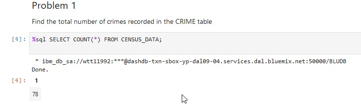
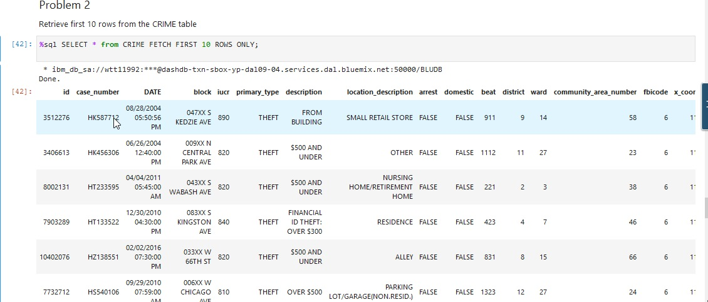
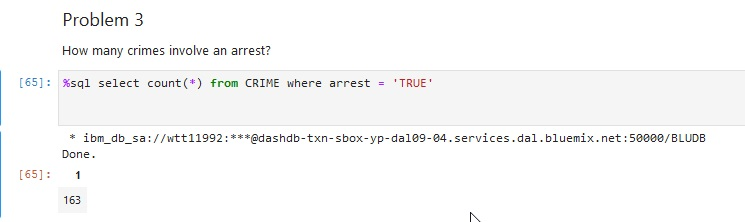
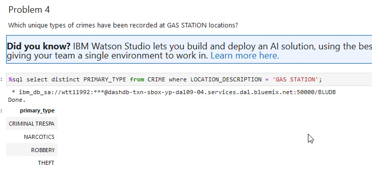
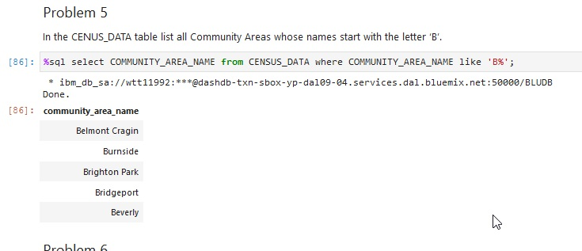
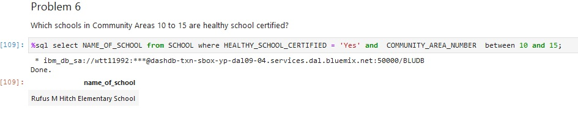
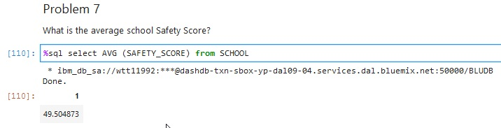
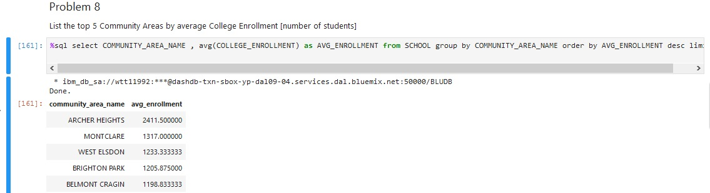
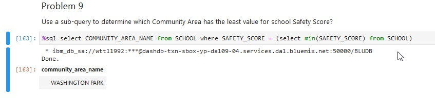
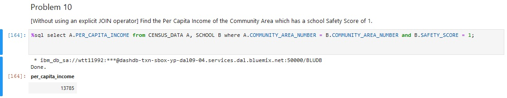

<h1>IBM Data Science Certification SQL and Database Project</h1>

This assignment involves 3 datasets for the city of Chicago obtained from the Chicago Data Portal: 

 
1. <a href="https://data.cityofchicago.org/Health-Human-Services/Census-Data-Selected-socioeconomic-indicators-in-C/kn9c-c2s2">Chicago Socioeconomic Indicators</a>
 This dataset contains a selection of six socioeconomic indicators of public health significance and a &ldquo;hardship index,&rdquo; by Chicago community area, for the years 2008 - 2012.

  
2. <a href="https://data.cityofchicago.org/Education/Chicago-Public-Schools-Progress-Report-Cards-2011-/9xs2-f89t">CPS School Report Cards</a> This dataset shows all school level performance data used to create CPS School Report Cards for the 2011-2012 school year.

  
3. <a href="https://data.cityofchicago.org/Public-Safety/Crimes-2001-to-Present/ijzp-q8t2">Crimes 2001-to-present</a>Chicago Crime Data This dataset reflects reported incidents of crime (with the exception of murders where data exists for each victim) that occurred in the City of Chicago from 2001 to present, minus the most recent seven days.

Compose and execute the appropriate SQL queries to answer each of the problems:

Problem 1: Find the total number of crimes recorded in the crime table.

Problem 2: Retrieve first 10 rows from the CRIME table.

Problem 3: How many crimes involve an arrest.

Problem 4: Which unique types of crimes (e.g. THEFT) have been recorded at a GAS STATION locations? 

 Problem 5: In the CENUS_DATA table list all community areas whose names start with the letter &lsquo;B&rsquo;.

Problem 6: List the schools in community areas 10 to 15 that are healthy school certified. 

Problem 7: What is the average school Safety Score? 

Problem 8: Find the top 5 Community Areas by average College Enrollment [number of students]. 

Problem 9: Use a sub-query todeterminewhich Community Area has the least value for school Safety Score?

Problem 10: [Without using an explicit JOIN operator] Find the Per Capita Income of the Community Area which has a school Safety Score of 1.

